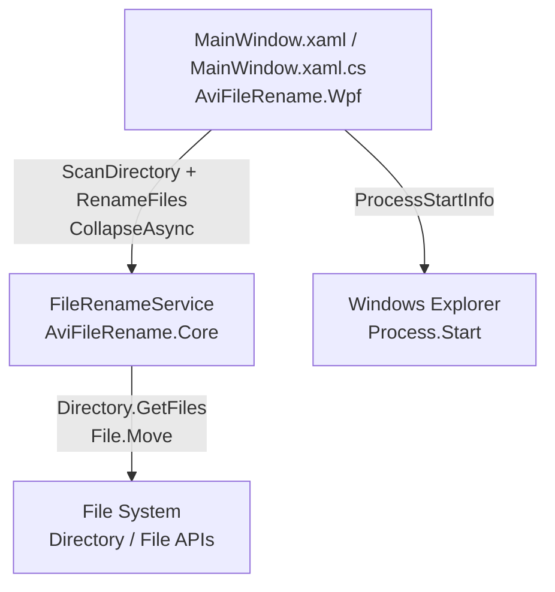
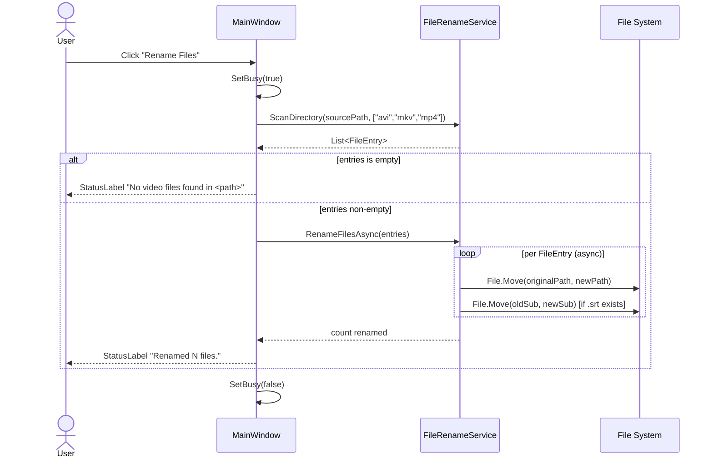
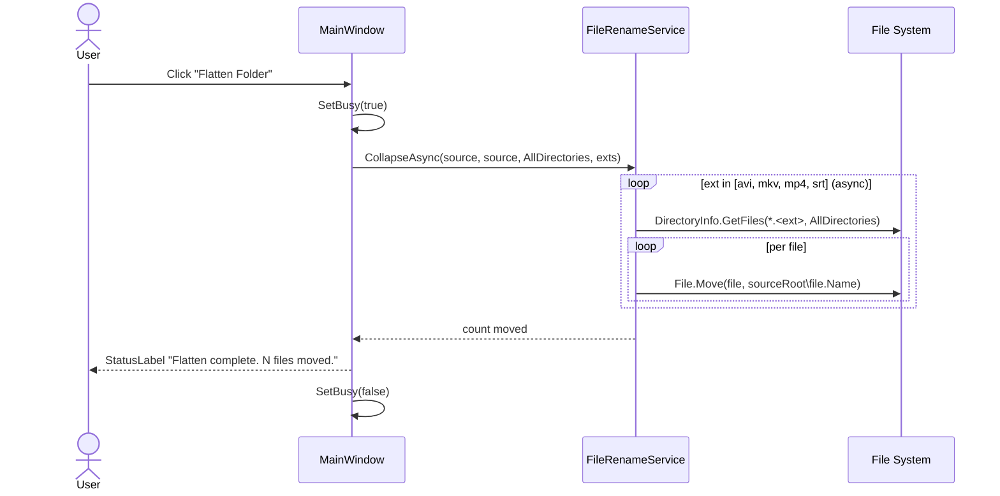
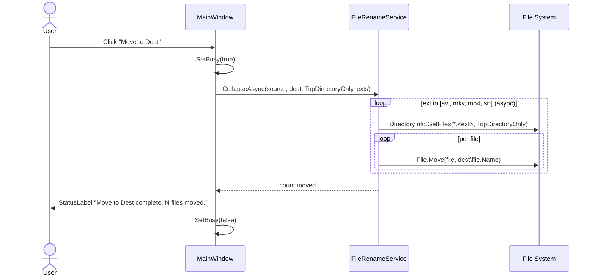

# Design Document: AviFileRename.Wpf

## Overview

AviFileRename.Wpf is a compact WPF desktop utility (net8.0-windows) for batch-renaming and organizing video files. It replaces the original WinForms version's per-file interactive approval dialog with fully automated batch processing, applying a regex-based filename normalization pipeline to produce clean, consistently formatted names for movies and TV episodes.

The application is split into two projects: `AviFileRename.Core` (a .NET class library containing `FileRenameService` and all file-operation logic) and `AviFileRename.Wpf` (the WPF host). The UI exposes four operations: batch rename in place, flatten a nested folder tree into the source root, move top-level files to a destination folder, and open the source folder in Explorer. All file operations run asynchronously so the UI stays responsive. Results are shown in a status label rather than a MessageBox.

## Architecture



The WPF project references `AviFileRename.Core`. WinForms interop (`UseWindowsForms`) is retained solely for `FolderBrowserDialog`.

## Solution Structure

```
AviFileRename.Core/
  AviFileRename.Core.csproj   (net8.0 class library)
  FileRenameService.cs
  FileEntry.cs

AviFileRename.Wpf/
  AviFileRename.Wpf.csproj    (net8.0-windows WPF, references Core)
  MainWindow.xaml
  MainWindow.xaml.cs
```

`FileEntry` is promoted to its own file in `AviFileRename.Core` so it is part of the public API.

## Sequence Diagrams

### Rename Files Flow



### Flatten Folder Flow



### Move to Dest Flow



## Components and Interfaces

### MainWindow

**Purpose**: Single-screen UI; owns folder path state and delegates all file operations to `FileRenameService`.

**Interface** (event handlers / helpers):
```csharp
// Async event handlers
async void RenameFilesButton_Click(object sender, RoutedEventArgs e)
async void FlattenFolderButton_Click(object sender, RoutedEventArgs e)
async void MoveToDestButton_Click(object sender, RoutedEventArgs e)
void SourceBrowseButton_Click(object sender, RoutedEventArgs e)
void DestBrowseButton_Click(object sender, RoutedEventArgs e)
void OpenFolderButton_Click(object sender, RoutedEventArgs e)

// UI helpers
void SetBusy(bool busy)   // disables buttons, changes cursor
void SetStatus(string message)  // updates StatusLabel
```

**Responsibilities**:
- Hold source/destination folder paths in `SourceTextBox` / `DestTextBox` (defaults: `D:\Downloads`, `D:\Videos\Movies`)
- Open `FolderBrowserDialog` (WinForms) for folder selection; both browse buttons have tooltips ("Select source folder" / "Select destination folder"); the OpenFolder button tooltip reads "Open source folder in Explorer"
- Invoke `FileRenameService` for all file operations via `await Task.Run(...)`
- Show operation results in `StatusLabel` (file count + outcome); no `MessageBox` for normal completion
- Disable all operation buttons and set `Cursor = Cursors.Wait` while an operation is running (`SetBusy`)
- Show `MessageBox` only for unexpected exceptions

**XAML layout changes from original**:
- Window `Height` increased to ~200, `ResizeMode` changed to `CanResizeWithGrip` (vertical resize allowed)
- Destination row (`DestTextBox` + `DestBrowseButton`) restored and visible (used by "Move to Dest")
- Button labels: "Rename Files", "Flatten Folder", "Move to Dest"
- `StatusLabel` added below the button row, spanning full width
- `SourceBrowseButton` tooltip: "Select source folder"; `DestBrowseButton` tooltip: "Select destination folder"; `OpenFolderButton` tooltip: "Open source folder in Explorer"

### FileRenameService (AviFileRename.Core)

**Purpose**: Instance service encapsulating all filename analysis, renaming, and folder-collapse logic. Designed for injection (constructor-injectable, no static state).

**Interface**:
```csharp
namespace AviFileRename.Core

public class FileRenameService
{
    // Scan source directory and build rename plan
    public List<FileEntry> ScanDirectory(string sourceDirectory, string[] extensions);

    // Apply the cleaning/normalization pipeline
    public string Clean(string name);   // instance method (not static)

    // Execute renames asynchronously; returns count of files renamed
    public Task<int> RenameFilesAsync(List<FileEntry> files);

    // Flatten files from source into destination asynchronously; returns count moved
    public Task<int> CollapseAsync(string source, string destination,
                                   SearchOption searchOption, string[] extensions);
}
```

**Responsibilities**:
- Recursively enumerate video files, skipping files whose name contains "sample"
- Apply the cleaning/normalization pipeline to produce `SuggestedName`
- Move files to their suggested names, co-renaming `.srt` subtitle files
- Skip rename if source == destination path or destination already exists
- Perform directory flatten (previously in `MainWindow.Collapse`) — `CollapseAsync` is the single place for all flatten/move operations
- Use word-boundary regex for noise token matching to avoid partial matches (e.g. "web" must not corrupt "webmaster")

**API consistency**: All public methods are instance methods. `Clean` is no longer `static` so the service can be injected and tested via an interface if needed.

## Data Models

### FileEntry

```csharp
// AviFileRename.Core/FileEntry.cs
namespace AviFileRename.Core

public class FileEntry
{
    public string OriginalPath  { get; set; }  // absolute path to the file
    public string OriginalName  { get; set; }  // filename without extension
    public string SuggestedName { get; set; }  // cleaned name without extension
    public string Extension     { get; set; }  // e.g. "mkv"
}
```

**Validation Rules**:
- `OriginalPath` must be a valid, existing file path at scan time
- `SuggestedName` is never null/empty (falls back to original if cleaning produces empty string)
- `Extension` is lowercase, no leading dot

### Noise Token Tables

```csharp
// Matched with word-boundary regex: \b<token>\b  (case-insensitive)
string[] NoiseTokens = {
    "1080p", "720p", "2160p", "4k",
    "x264", "h264", "x265", "h265", "hevc",
    "webrip", "web-dl", "webdl", "web", "hdrip",
    "dvdrip", "bdrip", "brrip", "hdtv", "bluray", "blueray", "bdremux",
    "xvid",
    "yify", "ettv", "eztv", "rarbg", "tgx", "evo", "ntb", "amzn", "nf",
    "proper", "repack", "extended", "remux"
};

// Matched as literal suffix strings (already bounded by leading "-")
string[] GroupSuffixes = {
    "-axxo", "-lol", "-2hd", "-fov", "-bia", "-fqm",
    "-notv", "-pow4", "-killers", "-evolve"
};
```

**Word-boundary matching**: Each noise token is matched via `Regex.Replace(text, @"\b" + Regex.Escape(token) + @"\b", " ", RegexOptions.IgnoreCase)` instead of `string.Replace`. This prevents tokens like `"web"` from corrupting words such as `"webmaster"` or `"weber"`.

## Algorithmic Pseudocode

### Clean() — Filename Normalization Pipeline

```pascal
ALGORITHM Clean(name: String) → String
INPUT:  raw filename without extension
OUTPUT: normalized, TitleCased filename

BEGIN
  IF name IS NULL OR WHITESPACE THEN
    RETURN ""
  END IF

  text ← name.ToLowerInvariant()

  // Step 1: Strip noise tokens using word-boundary regex
  FOR EACH token IN NoiseTokens DO
    text ← Regex.Replace(text, "\b" + Escape(token) + "\b", " ", IgnoreCase)
  END FOR

  // Step 2: Strip group suffixes (literal, bounded by leading "-")
  FOR EACH suffix IN GroupSuffixes DO
    text ← text.Replace(suffix, " ")
  END FOR

  // Step 3: Normalize structural tokens and separators
  text ← text.Replace("[eng]", " ")
  text ← Regex.Replace(text, "\bseries\b", "S", IgnoreCase)
  text ← Regex.Replace(text, "\bseason\b", "S", IgnoreCase)
  text ← Regex.Replace(text, "\bepisode\b", "E", IgnoreCase)
  text ← text.Replace(".", " ")
  text ← text.Replace("_", " ")
  text ← text.Replace("[", "(")
  text ← text.Replace("]", ")")
  text ← text.Replace("cd1", "1-2")
  text ← text.Replace("cd2", "2-2")

  // Step 4: Collapse multiple whitespace
  text ← Regex.Replace(text, \s+, " ").Trim()

  // Step 5: Identify and format as TV show or movie
  normalized ← NormalizeShowOrMovie(text)

  // Step 6: Clean up bracket artifacts
  normalized ← normalized.Replace("((", "(")
                          .Replace("))", ")")
                          .Replace("()", " ")

  // Step 7: Final whitespace collapse + TitleCase
  normalized ← Regex.Replace(normalized, \s+, " ").Trim()
  normalized ← TextInfo.ToTitleCase(normalized)

  RETURN normalized.Trim()
END
```

**Preconditions:**
- `name` is a filename string (may be null/empty)

**Postconditions:**
- Returns empty string if input is null/whitespace
- Result is TitleCased
- Result contains no noise tokens, group suffixes, or separator characters (`.` `_` `[` `]`)
- Word-boundary matching ensures tokens like "web" do not corrupt longer words
- Result is formatted as one of: `"Title S01E01"`, `"Title S01E01-E02"`, `"Title (2015)"`, or best-effort cleaned title

**Loop Invariants:**
- After each token replacement pass, the set of remaining noise tokens in `text` strictly decreases

---

### NormalizeShowOrMovie() — Pattern Matching

```pascal
ALGORITHM NormalizeShowOrMovie(input: String) → String
INPUT:  lowercased, separator-normalized filename fragment
OUTPUT: formatted show/movie name

BEGIN
  // Priority 1: Multi-episode TV  e.g. "show name s01e01-e02"
  multi ← MultiEpisodeTvRegex.Match(input)
  IF multi.Success THEN
    title  ← multi.Groups["title"].Trim()
    season ← ParseInt(multi.Groups["season"])
    ep1    ← ParseInt(multi.Groups["ep1"])
    ep2    ← ParseInt(multi.Groups["ep2"])
    extra  ← multi.Groups["extra"].Trim()

    result ← title + " S" + ZeroPad(season,2) + "E" + ZeroPad(ep1,2)
                   + "-E" + ZeroPad(ep2,2)
    IF extra ≠ "" THEN result ← result + " - " + extra END IF
    RETURN result
  END IF

  // Priority 2: Single-episode TV  e.g. "show name s01e02" / "1x02" / "102"
  tv ← SingleEpisodeTvRegex.Match(input)
  IF tv.Success THEN
    title ← tv.Groups["title"].Trim()

    IF tv.Groups["packed"].Success THEN
      packed  ← ParseInt(tv.Groups["packed"])
      season  ← packed / 100
      episode ← packed MOD 100
    ELSE
      season  ← ParseInt(tv.Groups["season"])
      episode ← ParseInt(tv.Groups["episode"])
    END IF

    extra ← tv.Groups["extra"].Trim()

    result ← title + " S" + ZeroPad(season,2) + "E" + ZeroPad(episode,2)
    IF extra ≠ "" THEN result ← result + " - " + extra END IF
    RETURN result
  END IF

  // Priority 3: Movie with year  e.g. "movie title 2015"
  movie ← MovieRegex.Match(input)
  IF movie.Success THEN
    title ← movie.Groups["title"].Trim()
    year  ← movie.Groups["year"]
    RETURN title + " (" + year + ")"
  END IF

  // Fallback: return as-is
  RETURN input
END
```

---

### RenameFilesAsync() — Atomic File Move

```pascal
ALGORITHM RenameFilesAsync(files: List<FileEntry>) → Task<int>
INPUT:  list of FileEntry with OriginalPath and SuggestedName populated
OUTPUT: count of files successfully renamed

BEGIN
  count ← 0
  FOR EACH entry IN files DO
    dir     ← GetDirectoryName(entry.OriginalPath)
    oldName ← GetFileNameWithoutExtension(entry.OriginalPath)
    newPath ← Combine(dir, entry.SuggestedName + "." + entry.Extension)

    IF entry.OriginalPath ≠ newPath AND NOT File.Exists(newPath) THEN
      await Task.Run(() => File.Move(entry.OriginalPath, newPath))
      count ← count + 1

      // Co-rename subtitle
      oldSub ← Combine(dir, oldName + ".srt")
      newSub ← Combine(dir, entry.SuggestedName + ".srt")
      IF File.Exists(oldSub) THEN
        await Task.Run(() => File.Move(oldSub, newSub))
      END IF
    END IF
  END FOR
  RETURN count
END
```

---

### CollapseAsync() — Directory Flatten / Move to Dest

```pascal
ALGORITHM CollapseAsync(source, destination, searchOption, extensions) → Task<int>
INPUT:  source dir, destination dir, search scope, file extensions
OUTPUT: count of files successfully moved

BEGIN
  count ← 0
  FOR EACH extension IN extensions DO
    info ← new DirectoryInfo(source)
    FOR EACH file IN info.GetFiles("*." + extension, searchOption) DO
      TRY
        await Task.Run(() =>
          File.Move(file.FullName, Combine(destination, file.Name)))
        count ← count + 1
      CATCH Exception
        // Silently ignore (e.g. duplicate filename at destination)
      END TRY
    END FOR
  END FOR
  RETURN count
END
```

**Note**: This method replaces the former `MainWindow.Collapse()` helper. All flatten/move logic now lives in `FileRenameService` — `MainWindow` has no direct `File.Move` calls.

**Preconditions:**
- `source` and `destination` are valid directory paths

**Postconditions:**
- All matching files from `source` (and subdirectories if `AllDirectories`) are moved to `destination` root
- Files that cannot be moved (duplicate name, permissions) are silently skipped
- Return value reflects only successfully moved files

## Key Functions with Formal Specifications

### ScanDirectory()

```csharp
public List<FileEntry> ScanDirectory(string sourceDirectory, string[] extensions)
```

**Preconditions:**
- `sourceDirectory` is a non-null string (directory may not exist — returns empty list)
- `extensions` is a non-null, non-empty array of lowercase extension strings without dots

**Postconditions:**
- Returns a list where every entry has `SuggestedName = Clean(OriginalName)`
- No entry has `OriginalName` containing "sample" (case-insensitive)
- Files from all subdirectories are included (recursive scan)
- Returns empty list (not null) when directory does not exist

### Clean()

```csharp
public string Clean(string name)   // instance method
```

**Preconditions:**
- `name` is any string (null/empty handled)

**Postconditions:**
- Null/whitespace input → returns `""`
- Output is TitleCased
- Output contains no tokens from `NoiseTokens` (word-boundary matched) or `GroupSuffixes`
- Output separators are spaces only (no `.`, `_`, `[`, `]`)
- Partial-word matches are preserved: "webmaster" is not corrupted by the "web" noise token

### RenameFilesAsync()

```csharp
public Task<int> RenameFilesAsync(List<FileEntry> files)
```

**Preconditions:**
- `files` is non-null

**Postconditions:**
- Each file is moved to `SuggestedName + "." + Extension` in its original directory
- No existing file is overwritten
- Matching `.srt` subtitle is co-renamed when present
- Returns count of files actually renamed (skipped entries not counted)
- Runs on a background thread; does not block the UI thread

### CollapseAsync()

```csharp
public Task<int> CollapseAsync(string source, string destination,
                               SearchOption searchOption, string[] extensions)
```

**Preconditions:**
- `source` and `destination` are non-null strings (directories should exist)
- `extensions` is non-null

**Postconditions:**
- All matching files moved to `destination` root
- Move failures silently skipped
- Returns count of files successfully moved
- Runs on a background thread; does not block the UI thread

## Example Usage

```csharp
// AviFileRename.Core injected as instance
var svc = new FileRenameService();

// Rename Files
var entries = svc.ScanDirectory(@"D:\Downloads", new[] { "avi", "mkv", "mp4" });
int renamed = await svc.RenameFilesAsync(entries);
StatusLabel.Content = $"Renamed {renamed} files.";

// Flatten Folder
int moved = await svc.CollapseAsync(
    @"D:\Downloads", @"D:\Downloads",
    SearchOption.AllDirectories,
    new[] { "avi", "mkv", "mp4", "srt" });
StatusLabel.Content = $"Flatten complete. {moved} files moved.";

// Move to Dest
int moved = await svc.CollapseAsync(
    @"D:\Downloads", @"D:\Videos\Movies",
    SearchOption.TopDirectoryOnly,
    new[] { "avi", "mkv", "mp4", "srt" });
StatusLabel.Content = $"Move to Dest complete. {moved} files moved.";
```

**Filename transformation examples:**

| Input filename | Output |
|---|---|
| `The.Dark.Knight.2008.1080p.BluRay.x264-YIFY` | `The Dark Knight (2008)` |
| `Breaking.Bad.S05E14.720p.HDTV.x264-KILLERS` | `Breaking Bad S05E14` |
| `Show.Name.S01E01-E03.WEBRip` | `Show Name S01E01-E03` |
| `Firefly.1x02.The.Train.Job.HDTV` | `Firefly S01E02 - The Train Job` |
| `Some.Show.102.HDTV` | `Some Show S01E02` |
| `webmaster.show.S01E01` | `Webmaster Show S01E01` (not corrupted by "web" token) |

## Correctness Properties

*A property is a characteristic or behavior that should hold true across all valid executions of a system — essentially, a formal statement about what the system should do. Properties serve as the bridge between human-readable specifications and machine-verifiable correctness guarantees.*

### Property 1: Clean is idempotent

*For any* string input, applying Clean twice SHALL produce the same result as applying it once: `Clean(Clean(x)) == Clean(x)`

**Validates: Requirement 3.9**

### Property 2: Clean never returns null

*For any* string input (including null), the result of Clean SHALL be a non-null string.

**Validates: Requirement 3.10**

### Property 3: No noise token survives cleaning as a whole word

*For any* string input and *for any* token in NoiseTokens, the output of Clean SHALL NOT contain that token as a whole word (word-boundary match, case-insensitive).

**Validates: Requirements 3.2**

### Property 4: Clean output contains no raw separator characters

*For any* string input, the output of Clean SHALL NOT contain `.` or `_` characters.

**Validates: Requirement 3.11**

### Property 5: RenameFilesAsync never overwrites an existing file

*For any* list of FileEntry records, if a destination file already exists on disk before RenameFilesAsync is called, that file SHALL remain unchanged after the call completes.

**Validates: Requirement 4.2**

### Property 6: ScanDirectory excludes sample files

*For any* source directory, the list returned by ScanDirectory SHALL NOT contain any entry whose OriginalName contains the substring "sample" (case-insensitive).

**Validates: Requirement 2.2**

### Property 7: TV episode output matches canonical pattern

*For any* input string that matches a TV episode pattern (single or multi-episode), the output of Clean SHALL match the regex `S\d{2}E\d{2}`.

**Validates: Requirements 3.5, 3.6**

### Property 8: Movie output wraps year in parentheses

*For any* input string that matches a movie pattern containing a four-digit year, the output of Clean SHALL match the regex `\(\d{4}\)`.

**Validates: Requirement 3.7**

### Property 9: Word-boundary safety — tokens do not corrupt longer words

*For any* word that contains a noise token as a substring but not as a complete whole word, Clean SHALL preserve that word unaltered (e.g. "webmaster" is not corrupted by the "web" noise token).

**Validates: Requirement 3.12**

### Property 10: ScanDirectory returns empty list for non-existent directory

*For any* directory path that does not exist on disk, ScanDirectory SHALL return an empty list and SHALL NOT throw an exception.

**Validates: Requirement 2.3**

## Error Handling

### Scenario 1: Source directory does not exist

**Condition**: `SourceTextBox.Text` points to a non-existent path when "Rename Files" is clicked  
**Response**: `ScanDirectory` returns an empty list; `RenameFilesButton_Click` detects `entries.Count == 0` and sets `StatusLabel` to `"No video files found in <path>."` — no rename is attempted and no misleading "0 files renamed" message is shown  
**Recovery**: User corrects the path via Browse button

### Scenario 2: File move collision during RenameFilesAsync

**Condition**: Destination filename already exists on disk  
**Response**: `RenameFilesAsync` silently skips that entry (guarded by `!File.Exists(newPath)`); skipped files are not counted in the return value  
**Recovery**: No action required; existing file is preserved

### Scenario 3: File move failure during CollapseAsync

**Condition**: `File.Move` throws (e.g. duplicate name, locked file, cross-device)  
**Response**: `CollapseAsync` catches all exceptions per file and continues; failed files are not counted  
**Recovery**: Unaffected files are still moved; failed files remain in subdirectories

### Scenario 4: OpenFolder fails

**Condition**: `Process.Start` throws (e.g. path does not exist)  
**Response**: `MessageBox.Show` displays the exception message  
**Recovery**: User corrects the source path

### Scenario 5: FolderBrowserDialog cancelled

**Condition**: User opens Browse dialog and clicks Cancel  
**Response**: `dialog.ShowDialog()` returns non-OK; `TextBox.Text` is unchanged  
**Recovery**: No action required

### Scenario 6: Operation already in progress

**Condition**: User clicks an operation button while another is running  
**Response**: `SetBusy(true)` disables all operation buttons; clicks are ignored until `SetBusy(false)` is called on completion  
**Recovery**: Buttons re-enable automatically when the operation finishes

## Testing Strategy

### Unit Testing Approach

`FileRenameService.Clean()` is a pure function and the primary unit test target.

Key test cases:
- Noise token stripping (each token in `NoiseTokens`) — verify whole-word match only
- Word-boundary safety: "webmaster", "weber", "extended-play" not corrupted
- Group suffix stripping (each suffix in `GroupSuffixes`)
- Multi-episode TV pattern: `S01E01-E02`, `S01E01-02`
- Single-episode TV pattern: `S01E02`, `1x02`, packed `102`
- Movie year pattern: bare year, parenthesized year
- Separator normalization: `.`, `_`, `[`, `]`
- Edge cases: empty string, null, already-clean name, name with no recognizable pattern
- Idempotency: `Clean(Clean(x)) == Clean(x)` for a broad set of inputs
- `ScanDirectory` returns empty list for non-existent directory (not an exception)

### Property-Based Testing Approach

**Property Test Library**: FsCheck (xUnit integration for .NET)

Properties to verify:
- `Clean` is idempotent for all non-null strings
- `Clean` never returns null
- No noise token (as whole word) appears in `Clean` output
- Output of `Clean` on a TV-pattern input always matches `S\d{2}E\d{2}`
- Output of `Clean` on a movie-pattern input always matches `\(\d{4}\)`
- `Clean` output never contains `.` or `_`

### Integration Testing Approach

- Create a temporary directory with known filenames, run `ScanDirectory` + `RenameFilesAsync`, assert resulting filenames on disk
- Verify `.srt` co-rename: place `Show.S01E01.mkv` + `Show.S01E01.srt`, rename, assert both renamed
- Verify no-overwrite guard: pre-create destination file, assert source file unchanged after rename
- Verify `CollapseAsync` with `AllDirectories`: nested files moved to root, return count matches moved files
- Verify `CollapseAsync` with `TopDirectoryOnly`: only top-level files moved, subdirectory files untouched

## Performance Considerations

All file operations run via `await Task.Run(...)` on a thread-pool thread, keeping the WPF UI thread free. The `SetBusy` mechanism (disabled buttons + wait cursor) provides visual feedback during operations.

Regex patterns are compiled (`RegexOptions.Compiled`) to amortize compilation cost across the batch. For the expected scale (tens to low hundreds of files on a local drive) this is sufficient; a `Progress<T>` callback could be added later for per-file progress reporting.

## Security Considerations

- All file operations are scoped to user-specified directories; no elevation is required
- `Process.Start` with `UseShellExecute = true` opens the folder via the shell, not an arbitrary executable
- No network access, no external data sources
- Input paths are taken directly from user-editable TextBoxes; no sanitization is needed beyond what the OS enforces on `File.Move` / `Directory.GetFiles`

## Dependencies

| Dependency | Version | Purpose |
|---|---|---|
| .NET 8 WPF (`UseWPF`) | net8.0-windows | UI framework |
| .NET 8 WinForms (`UseWindowsForms`) | net8.0-windows | `FolderBrowserDialog` interop |
| `System.Text.RegularExpressions` | BCL | Compiled regex for pattern matching and word-boundary noise removal |
| `System.Globalization.TextInfo` | BCL | `ToTitleCase` for output formatting |

No third-party NuGet packages are required.

## Evolution from WinForms Version

| Aspect | WinForms (AviFileRename) | WPF original | WPF updated |
|---|---|---|---|
| Rename UX | Per-file `EditFileName` dialog | Fully automated batch | Fully automated batch + async |
| CollapseToDest | Functional button | Commented out | Restored as "Move to Dest" |
| Feedback | Dialog per operation | MessageBox | StatusLabel (inline) |
| File ops location | Inline in form | Mixed (service + MainWindow) | All in `FileRenameService` |
| Noise matching | `string.Replace` | `string.Replace` | Word-boundary regex |
| API style | N/A | Mixed static/instance | All instance methods |
| Project structure | Single project | Single project | Core library + WPF host |
| UI thread blocking | Yes | Yes | No (async/await) |
